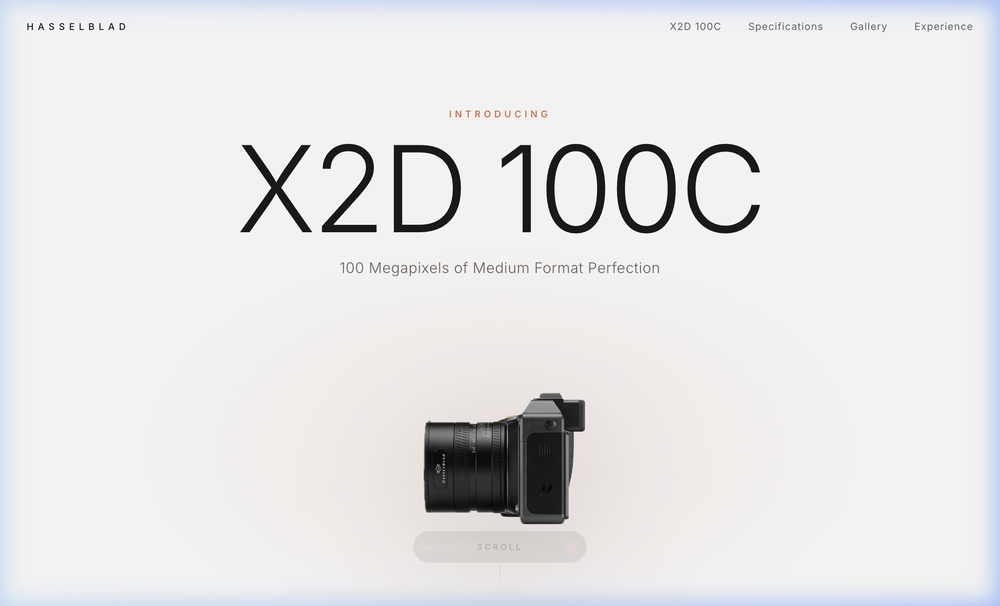
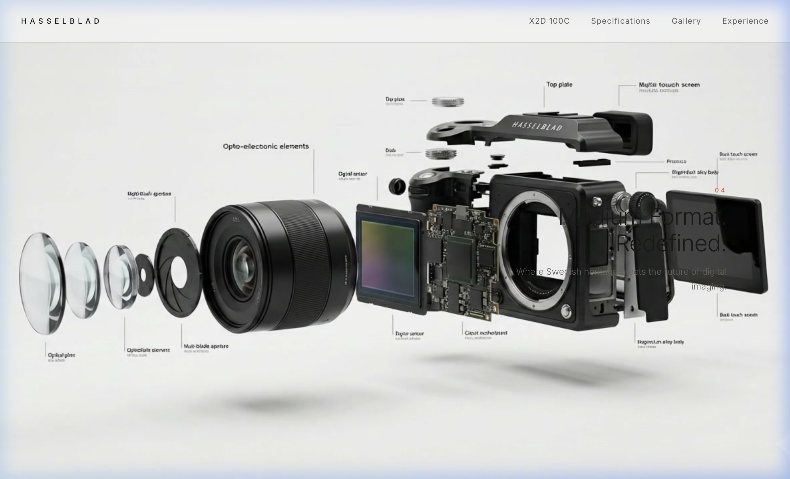
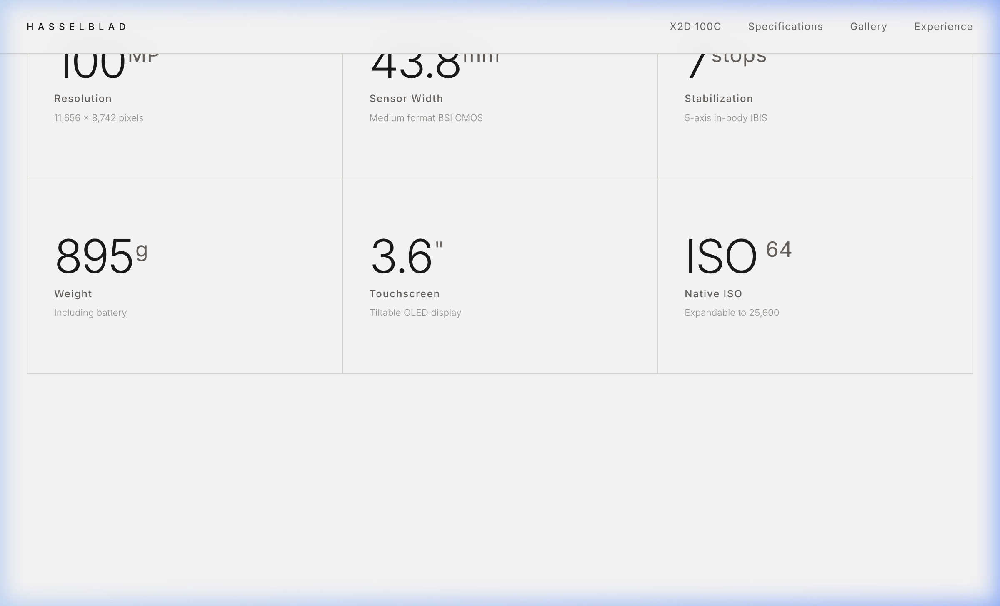
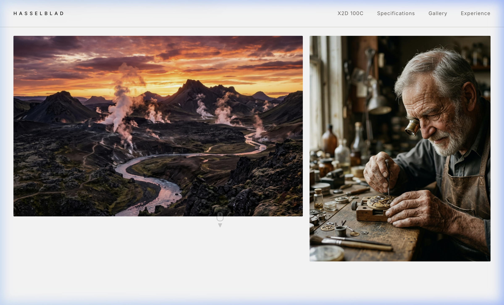

<div align="center">



<br/>
<br/>

# HASSELBLAD X2D 100C

### A Scroll-Driven Cinematic Product Experience

<br/>

[](https://vitejs.dev/)
[](https://developer.mozilla.org/en-US/docs/Web/JavaScript)
[](https://developer.mozilla.org/en-US/docs/Web/API/Canvas_API)
[](LICENSE)
[](https://github.com/1sarthak7)

<br/>

*A premium landing page for the Hasselblad X2D 100C medium format camera, featuring an Apple-style scroll-driven frame animation rendered on HTML5 Canvas. No frameworks. No libraries. Just the browser.*

---

</div>

<br/>

## The Experience

This isn't a typical product page. It's a **240-frame cinematic scroll animation** — the same technique Apple uses on their AirPods, MacBook, and iPhone product pages — built from scratch with vanilla JavaScript and `<canvas>`.

As the user scrolls, the camera body rotates, disassembles, and reveals its internals. Feature callouts appear and disappear at precise scroll positions, synchronized to the animation.

<br/>

<div align="center">

<br/>
<sup>Phase overlay cards appear at specific scroll positions, tied to the animation content</sup>
</div>

<br/>

---

<br/>

## Architecture

```
                    MP4 Video
                       |
                    FFMPEG
                       |
              240 JPEG Frames
                       |
        +--------------+--------------+
        |              |              |
   Batch Preloader  Canvas 2D    Scroll Logic
        |              |              |
   Loading Screen   rAF Loop    { passive: true }
        |              |              |
        +--------------+--------------+
                       |
              Scroll-Driven Animation
```

The animation pipeline follows a strict separation of concerns:

| Layer | Responsibility | Key Detail |
|:------|:---------------|:-----------|
| **Preloader** | Loads all 240 frames in batches of 20 | Shows progress bar; never lazy-loads mid-scroll |
| **Scroll Handler** | Calculates scroll progress and frame index | `{ passive: true }` — never blocks the main thread |
| **rAF Renderer** | Draws frames to `<canvas>` | Only repaints when `currentFrame !== drawnFrame` |
| **Phase Controller** | Shows/hides content overlays | Tied to scroll position ranges, not timers |

<br/>

---

<br/>

## Sections

<br/>

<table>
<tr>
<td width="50%">

### Hero

Full-viewport introduction with large-scale typography and a studio-lit product shot. Subtle scroll indicator pulses at the bottom.

The "Introducing" eyebrow, title, and subtitle animate in via IntersectionObserver on first load.

</td>
<td width="50%">


</td>
</tr>
</table>

<br/>

<table>
<tr>
<td width="50%">


</td>
<td width="50%">

### Scroll Animation

The core experience. A `500vh` tall scroll container with a `position: sticky` canvas pinned to the viewport.

**4 phase overlays** appear at calculated scroll ranges:
- 01 — 100MP BSI CMOS Sensor
- 02 — Machined Aluminum Body
- 03 — 5-Axis 7-Stop IBIS
- 04 — Medium Format. Redefined.

</td>
</tr>
</table>

<br/>

<table>
<tr>
<td width="50%">

### Specifications

Clean grid layout with staggered reveal animations. Each card enters the viewport with a slight delay after the previous one.

Six key specs: resolution, sensor width, stabilization, weight, touchscreen, and native ISO.

</td>
<td width="50%">



</td>
</tr>
</table>

<br/>

<table>
<tr>
<td width="50%">



</td>
<td width="50%">

### Gallery

Full-bleed imagery showcasing what the X2D 100C captures. Hover reveals EXIF-style metadata captions.

Images scale subtly on hover with a `1.2s ease-out` transition for a tactile feel.

</td>
</tr>
</table>

<br/>

---

<br/>

## Technical Implementation

### Scroll Animation Pipeline

```javascript
// Scroll handler — state only, no rendering
window.addEventListener('scroll', () => {
    const progress = getScrollProgress();
    currentFrame = Math.floor(progress * TOTAL_FRAMES);
}, { passive: true });

// rAF loop — renders only when frame changes
function tick() {
    if (currentFrame !== drawnFrame) {
        ctx.drawImage(frames[currentFrame], 0, 0, FW, FH);
        drawnFrame = currentFrame;
    }
    requestAnimationFrame(tick);
}
```

### Frame Preloading

All 240 frames are loaded **before** the experience starts. Batch loading (20 at a time) keeps the browser's connection pipeline saturated without overwhelming it:

```javascript
for (let i = 0; i < TOTAL; i += BATCH_SIZE) {
    const batch = frames.slice(i, i + BATCH_SIZE).map(loadFrame);
    await Promise.all(batch);
    onProgress(i + BATCH_SIZE, TOTAL);
}
```

### Canvas Cover Strategy

The canvas uses a **cover** scaling strategy — filling the entire viewport edge-to-edge, cropping excess rather than letterboxing:

```javascript
const scale = Math.max(vpW / FW, vpH / FH);
```

<br/>

---

<br/>

## Project Structure

```
hasselblad-x2d/
  index.html              Single-page HTML with semantic sections
  package.json            Vite dev server configuration
  public/
    frames/               240 JPEG frames extracted from MP4
    hero-camera.png       Product hero image
    gallery-landscape.png Sample landscape photograph
    gallery-portrait.png  Sample portrait photograph
  src/
    main.js               Boot sequence and module orchestration
    style.css             Design system, layout, animations
    scroll-animation.js   Canvas renderer and scroll logic
    animations.js         IntersectionObserver reveals, navbar
```

<br/>

---

<br/>

## Quick Start

**Prerequisites:** Node.js 18+ and FFMPEG (for frame extraction from your own video).

```bash
# Clone the repository
git clone https://github.com/1sarthak7/Hasselblad-x2d.git
cd Hasselblad-x2d

# Install dependencies
npm install

# Start the dev server
npm run dev
```

The dev server will start at `http://localhost:5173/`.

### Extracting Frames from Video

If you're working with a new source video:

```bash
mkdir -p public/frames
ffmpeg -i your-video.mp4 -vf "fps=30" -q:v 2 public/frames/frame-%04d.jpg
```

Adjust `fps=30` for more or fewer frames. 120-240 frames is the sweet spot for smooth scroll scrubbing without excessive file size.

<br/>

---

<br/>

## Design Decisions

| Decision | Choice | Rationale |
|:---------|:-------|:----------|
| **Framework** | None (vanilla JS) | A landing page doesn't need React. Zero bundle overhead. |
| **Image format** | JPEG | WebP encoder unavailable in default FFMPEG build; JPEG at quality 2 is visually lossless |
| **Canvas vs Video** | `<canvas>` | `video.currentTime` cannot be scrubbed frame-accurately; canvas gives instant, pixel-perfect switching |
| **Scroll handling** | Passive listener + rAF | Never blocks scrolling; never redraws the same frame twice |
| **Layout** | Sticky + tall container | Pure CSS positioning; no JavaScript-driven scroll hijacking |
| **Typography** | Inter | Clean geometric sans-serif that matches Hasselblad's Scandinavian design language |
| **Color palette** | Light with dark text | Matches the video's white studio background for seamless integration |

<br/>

---

<br/>

## Performance

- **240 frames** at ~69KB average = ~16.5MB total payload
- **Batched preloading** prevents connection saturation
- **Passive scroll listener** never blocks the main thread
- **Conditional rendering** — `drawImage` only fires when the frame index changes
- **No layout thrashing** — scroll handler reads `getBoundingClientRect` only, never writes to DOM
- **Zero dependencies** — no runtime libraries, no framework overhead

<br/>

---

<br/>

## Author

<table>
<tr>
<td>

**Sarthak Bhopale** — [github.com/1sarthak7](https://github.com/1sarthak7)

Built as a portfolio project to demonstrate scroll-driven animation techniques, canvas rendering, and premium web design.

</td>
</tr>
</table>

<br/>

---

<br/>

## License

This project is licensed under the **MIT License** — see the [LICENSE](LICENSE) file for details.

<br/>

---

<br/>

<div align="center">

Built with precision by [Sarthak Bhopale](https://github.com/1sarthak7).

<br/>

<sub>This is a portfolio/demonstration project and is not affiliated with or endorsed by Victor Hasselblad AB.</sub>
<br/>
<sub>Camera imagery and specifications are used for educational and demonstration purposes only.</sub>

</div>
